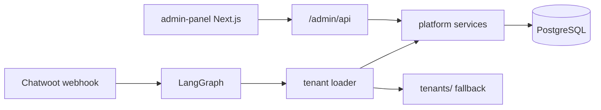

# Architecture Spine — Plataforma SaaS Harness

## Paradigm

**Brownfield modular monolith:** FastAPI harness existente ganha módulo `platform/` (dados + serviços) e `admin/` (rotas REST). Painel Next.js é deploy separado no mesmo servidor. PostgreSQL como source of truth para config de tenant.

## Inherited Invariants (código existente)

- `TenantConfig` dataclass permanece contrato interno do harness
- Webhook Chatwoot: HMAC + dedupe + BackgroundTasks
- LangGraph pipeline inalterado na superfície de nós
- RAG/memória SQLite mantidos até Epic 5

## AD-1: TenantConfig como interface interna

**Binds:** Loader retorna `TenantConfig`; harness não conhece SQL.  
**Prevents:** Vazamento de ORM no grafo LangGraph.  
**Rule:** `DbTenantLoader` mapeia rows → `TenantConfig`; `root_dir` vazio quando DB-only.

## AD-2: API keys LLM server-side only

**Binds:** Tabela `llm_providers.encrypted_api_key`; tenants usam `model_id`.  
**Prevents:** Exposição de chaves no painel ou JWT payload.  
**Rule:** `LLMRegistry.get_client(tenant)` resolve key em runtime.

## AD-3: Usage events em toda chamada LLM

**Binds:** Hook pós-invoke registra tokens e custo.  
**Prevents:** Billing cego.  
**Rule:** Falha no log não bloqueia resposta ao cliente.

## AD-4: Admin API JWT + RBAC

**Binds:** `/admin/api/*` exige Bearer JWT; role `super_admin` no MVP.  
**Prevents:** CRUD tenants sem auth (como `/ops/*` hoje).  
**Rule:** Webhook Chatwoot mantém HMAC separado.

## AD-5: PostgreSQL para plataforma

**Binds:** `DATABASE_URL`; Alembic migrations em `alembic/`.  
**Prevents:** Config em pastas para novos tenants.  
**Rule:** SQLite permanece para RAG/memória até migração explícita.

## AD-6: Hot-reload via cache

**Binds:** `TenantCache` TTL 60s; `invalidate(tenant_id)` em writes admin.  
**Prevents:** Restart para novo cliente.  
**Rule:** `resolve_tenant()` consulta cache → DB → filesystem fallback.

## AD-7: Untitled UI React no admin-panel

**Binds:** `npx untitledui@latest init --nextjs`; componentes free MIT.  
**Prevents:** Mistura de design systems no mesmo app.  
**Rule:** Figma kit como referência UX; `theme.css` tokens oficiais.

## Module Boundaries

```
ai/
├── admin/           # FastAPI routers, deps auth
├── platform/        # SQLAlchemy models, repos, services
│   ├── db.py
│   ├── models.py
│   ├── tenant_service.py
│   └── llm_registry.py
└── tenants/
    ├── loader.py    # Facade: DB → FS fallback
    └── db_loader.py
admin-panel/         # Next.js 15 + Untitled UI
alembic/             # Migrations
```

## Data Model (seed)

| Table | Purpose |
|-------|---------|
| `admin_users` | email, password_hash, role |
| `tenants` | id, name, language, active, settings_json |
| `tenant_prompts` | tenant_id, name, content |
| `llm_providers` | name, provider_type, encrypted_api_key |
| `llm_models` | provider_id, model_id, display_name, cost_per_1m_in/out |
| `tenant_allowed_models` | tenant_id, model_id, is_default |
| `usage_events` | tenant_id, model_id, tokens_in, tokens_out, cost, created_at |

## API Surface (admin)

| Method | Path | Purpose |
|--------|------|---------|
| POST | `/admin/api/auth/login` | JWT |
| GET | `/admin/api/tenants` | List |
| POST | `/admin/api/tenants` | Create |
| GET | `/admin/api/tenants/{id}` | Detail |
| PUT | `/admin/api/tenants/{id}` | Update |
| PATCH | `/admin/api/tenants/{id}/active` | Toggle |
| PUT | `/admin/api/tenants/{id}/prompts/{name}` | Prompt CRUD |

## Deferred

- Redis para filas e cache distribuído
- Anthropic/Gemini providers (interface only MVP)
- Postgres para RAG chunks
- tenant_admin role e painel cliente
- Stripe billing

## Diagram


